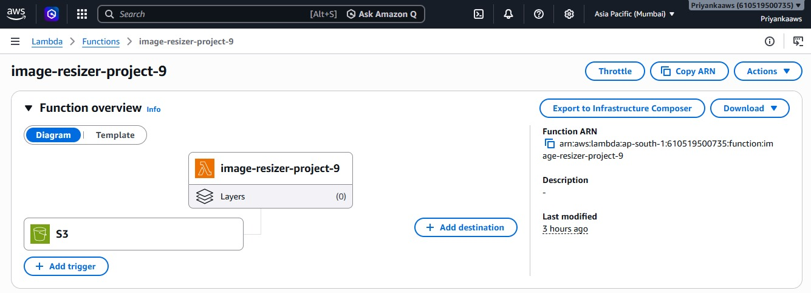
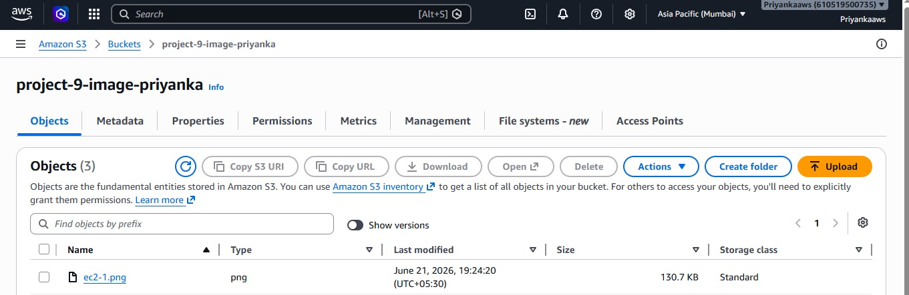
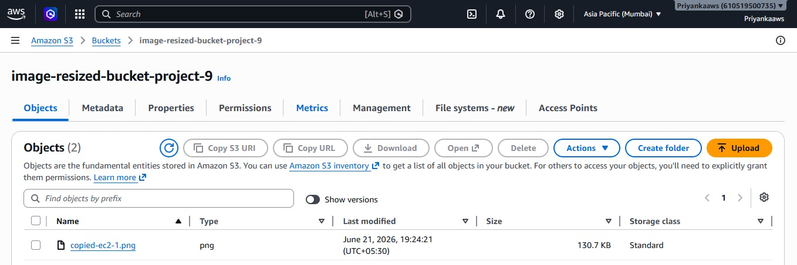

# AWS Serverless Image Processing Project

## Overview

This project demonstrates a serverless image processing workflow using AWS Lambda and Amazon S3.

When a file is uploaded to the source S3 bucket, an AWS Lambda function is automatically triggered. The Lambda function processes the uploaded file and copies it to a destination S3 bucket.

## AWS Services Used

* AWS Lambda
* Amazon S3
* AWS IAM
* CloudWatch Logs

## Architecture

Source S3 Bucket → Lambda Trigger → Lambda Function → Destination S3 Bucket

## Features

* Event-driven architecture
* Automatic file processing
* Serverless deployment
* IAM-based secure access
* CloudWatch monitoring and logging

## Project Workflow

1. Upload a file to the source S3 bucket.
2. S3 event notification triggers AWS Lambda.
3. Lambda function processes the uploaded object.
4. Processed file is copied to the destination S3 bucket.
5. CloudWatch Logs record execution details.

## Skills Demonstrated

* AWS Lambda
* Amazon S3
* IAM Roles and Policies
* Python (Boto3)
* Event-Driven Architecture
* Cloud Monitoring

## SCREENSHOT

## Screenshots

### Lambda Function

### S3 Trigger

### Successful Output

## Author

Priyanka Dalavi
Aspiring AWS Cloud Engineer
